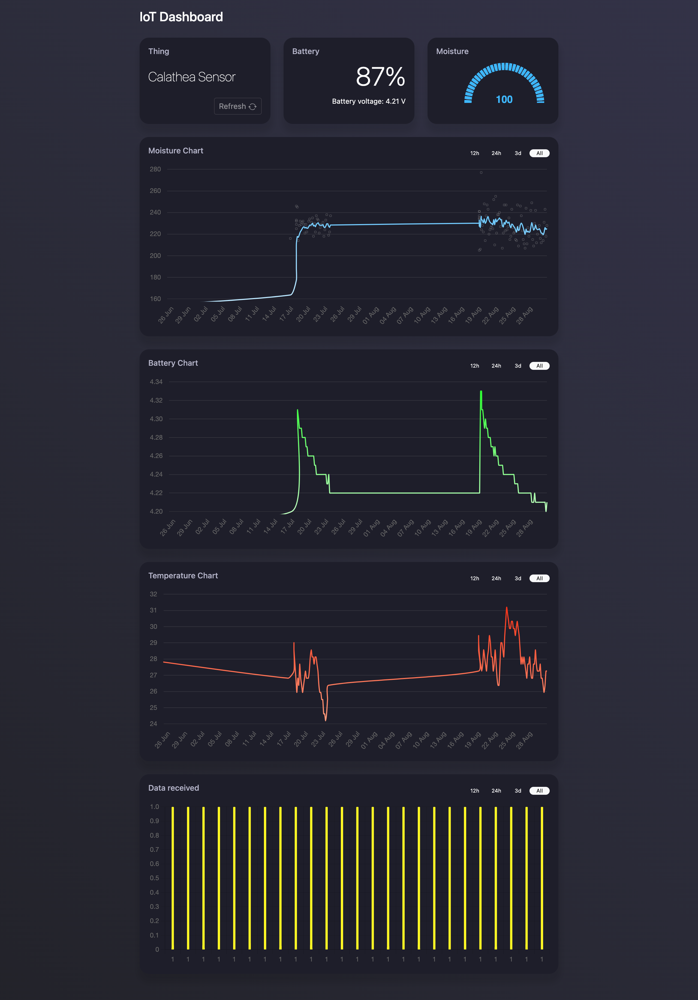

# IoT Dashboard

Simple UI dashboard for visualising data collected from IoT sensors.
The sensor transmits data using the MQTT protocol to an AWS Lambda function via the AWS IoT broker. The Lambda function subsequently uploads this data to an AWS DynamoDB, and the dashboard establishes a connection to the database through a CRUD API.

Here's an overview of the key components and their interactions:

1. **Sensor Data Collection:**
   - Sensors collect data and transmit it using the MQTT protocol.

2. **AWS IoT Broker:**
   - The MQTT data is sent to an AWS IoT broker, which serves as a central communication hub.

3. **AWS Lambda Function:**
   - An AWS Lambda function is triggered by incoming MQTT messages.
   - This Lambda function processes and uploads the data to an AWS DynamoDB database.

4. **AWS DynamoDB:**
   - AWS DynamoDB is used as the data storage backend.

5. **Dashboard Integration:**
   - A dashboard downloads the data through a CRUD (Create, Read, Update, Delete) API and shows it in charts
